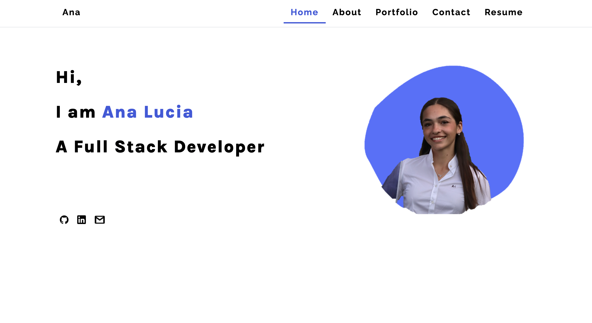

# Ana Lucia Rojas Portfolio 

## Description

This is my portfolio, I created using the latest React technologies. It will include an About, contact, portfolio, and Resume section. 

## Table of Contents

* [Technologies](#technologies)
* [Preview](#preview)
* [Links](#links)

## Technologies

* JavaScript
* React
* HTML
* CSS 

## Preview

This is an image of the deployed portfolio application.  

## Links

* [URL of the deployed App](https://analuciarojas.github.io/AnaLuciaRojas-Portfolio/)

* [URL of the GitHub repository](https://github.com/analuciarojas/AnaLuciaRojas-Portfolio)

